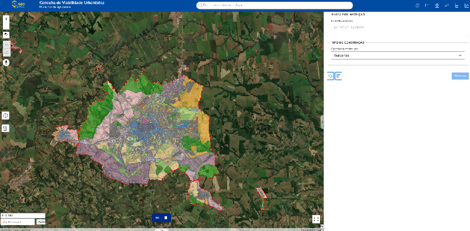
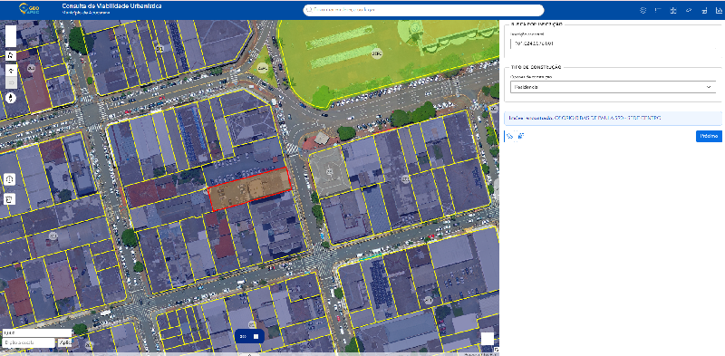
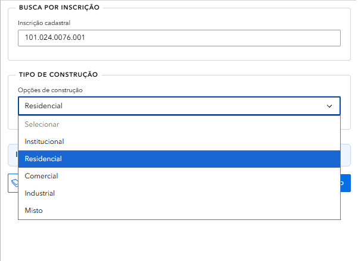
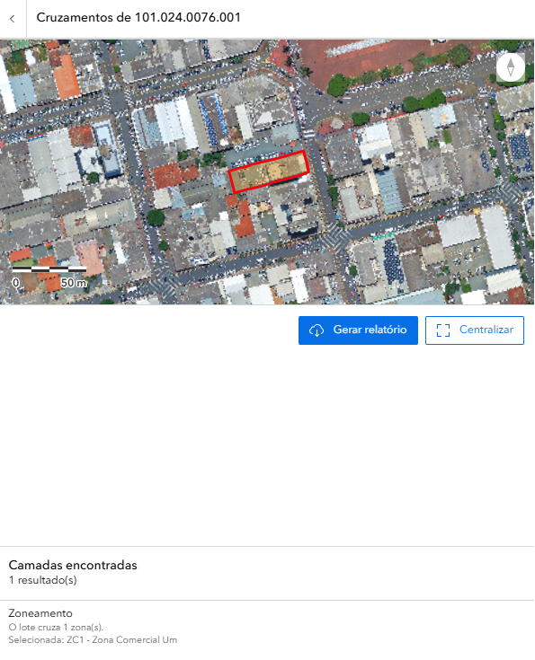
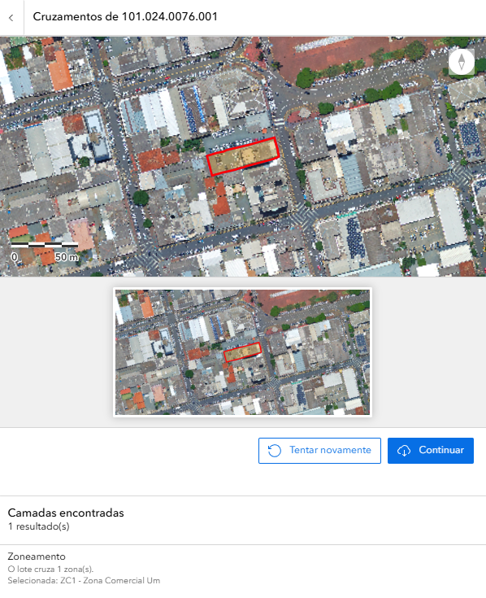
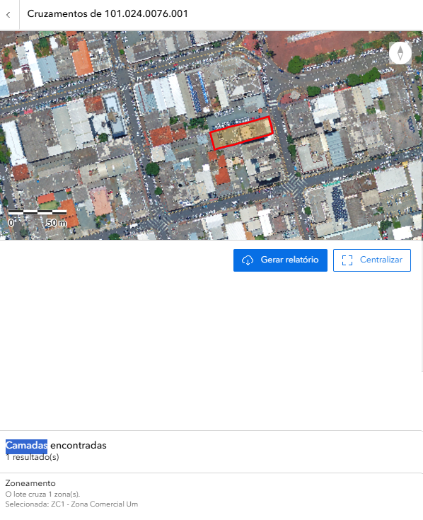

  

# 🏗️ Tutorial: Consulta de Viabilidade Urbanística

**Município de Apucarana - Guia Prático de Uso**

---

## 📑 Índice

1. [Introdução](#introdução)
2. [A Interface](#a-interface)
3. [Como Buscar](#como-buscar)
4. [Tipos de Construção](#tipos-de-construção)
5. [Análise Espacial](#análise-espacial)
6. [Geolocalização e Validação](#geolocalização-e-validação)
7. [Relatório de Viabilidade](#relatório-de-viabilidade)
8. [Casos Práticos](#casos-práticos)
9. [FAQ](#faq)

---

## 🎯 Introdução 

Bem-vindo ao tutorial da aplicação **Consulta de Viabilidade Urbanística**! Esta ferramenta permite verificar as condições urbanísticas de um terreno no município de Apucarana, identificando o zoneamento, os parâmetros de uso e ocupação do solo, e gerando um relatório oficial de viabilidade.

### O que você vai aprender:

- Como navegar na interface da aplicação
- Buscar um terreno por inscrição cadastral
- Selecionar o tipo de construção pretendida
- Interpretar o resultado da análise espacial
- Validar a geolocalização do imóvel
- Gerar e interpretar o relatório de viabilidade urbanística

> 💡 **Dica:** Este tutorial leva aproximadamente 15 minutos para ser concluído. Você pode navegar pelas seções clicando no índice acima.

---

## 🖥️ A Interface 

### 1️⃣ O Mapa Interativo Central

A parte central da tela exibe o mapa do município de Apucarana com a malha cadastral dos lotes urbanos destacada.

*Mapa interativo da Consulta de Viabilidade Urbanística*

> 💡 Você pode ampliar (zoom) e mover o mapa usando o mouse. Use a rodinha do mouse para zoom!

### 2️⃣ O Painel Lateral Direito

À direita, você encontra o painel de consulta com dois campos principais:

- **Busca por Inscrição:** campo para digitar a inscrição cadastral do terreno
- **Tipo de Construção:** dropdown para selecionar a finalidade do empreendimento

### 3️⃣ Controles do Mapa

À esquerda do mapa, você encontra os botões de controle:

- **+/-** Zoom in e zoom out
- **🏠** Voltar para a visão inicial
- **⬅️➡️** Navegar entre visualizações anteriores
- **⬆️** Bússola / orientação do mapa
- **ℹ️** Informações
- **🗑️** Limpar seleção

### 4️⃣ Barra Superior

Na parte superior da tela você encontra:

- **Logo GeoAPUC** e título **"Consulta de Viabilidade Urbanística"**
- **Barra de busca** central: "Encontrar endereço ou lugar"
- **Ícones** no canto direito: camadas, lista, grid, régua, impressora e gráfico

---

## 🔍 Como Buscar 

### 1️⃣ Digite a Inscrição Cadastral

No painel lateral direito, localize o campo **"Inscrição cadastral"** e digite o número do imóvel.

*Campo de busca por inscrição cadastral*

O formato da inscrição é:
**Exemplo:** `101.024.0076.001`

> 💡 Se não souber a inscrição cadastral, utilize a barra de busca superior para localizar o endereço no mapa e identificar o lote desejado.

### 2️⃣ Selecione o Tipo de Construção

Logo abaixo do campo de inscrição, clique no dropdown **"Opções de construção"** e selecione a finalidade do empreendimento.

*Dropdown com as opções de tipo de construção*

As opções disponíveis são:

| Tipo | Descrição |
|------|-----------|
| **Institucional** | Equipamentos públicos, igrejas, escolas, hospitais |
| **Residencial** | Habitações unifamiliares e multifamiliares |
| **Comercial** | Comércio e prestação de serviços |
| **Industrial** | Atividades produtivas e manufatureiras |
| **Misto** | Combinação de usos (ex: residencial + comercial) |

### 3️⃣ Clique em "Próximo"

Após preencher a inscrição e selecionar o tipo de construção, clique no botão **"Próximo >"** para iniciar a análise.

---

## 🏗️ Tipos de Construção 

Cada tipo de construção está sujeito a regras específicas definidas pelo **Plano Diretor Municipal** e pelo **Código de Obras e Edificações** de Apucarana. Veja o que cada categoria contempla:

### 🏠 Residencial
Destinado à moradia. Inclui casas, sobrados, apartamentos e condomínios. As exigências variam conforme o zoneamento (recuos, taxa de ocupação, coeficiente de aproveitamento).

### 🏪 Comercial
Destinado ao comércio varejista e atacadista, e à prestação de serviços. Deve ser compatível com o zoneamento local.

### 🏭 Industrial
Destinado à produção manufatureira. Geralmente restrito a zonas industriais (ZI) e zonas especializadas de produção (ZEPC).

### 🏛️ Institucional
Destinado a equipamentos e serviços públicos ou comunitários: escolas, postos de saúde, igrejas, associações.

### 🔀 Misto
Combinação de dois ou mais usos no mesmo imóvel. Sujeito às regras de todos os usos combinados.

> ⚠️ A viabilidade de cada tipo de construção depende diretamente do zoneamento do terreno. Consulte sempre o resultado da análise espacial antes de tomar decisões.

---

## 📍 Análise Espacial 

Após clicar em "Próximo", o sistema realiza automaticamente uma **análise espacial** do terreno, cruzando a inscrição cadastral com as camadas de zoneamento municipal.

*Resultado da análise espacial com zoneamento identificado*

### O que o sistema verifica:

- **Localização exata** do lote no mapa cadastral
- **Zoneamento** em que o lote está inserido
- **Camadas encontradas** e número de resultados

### Interpretando o Resultado

No exemplo acima, para a inscrição `101.024.0076.001`:

| Campo | Resultado |
|-------|-----------|
| **Camadas encontradas** | 1 resultado(s) |
| **Zoneamento** | O lote cruza 1 zona(s) |
| **Zona selecionada** | ZC1 - Zona Comercial Um |

> 💡 O lote aparece destacado em **vermelho** no mapa para facilitar a identificação visual.

Os botões disponíveis nesta etapa são:
- **🔄 Gerar relatório** — avança para a geração do documento oficial
- **⬜ Centralizar** — centraliza o mapa no lote encontrado

---

## 🗺️ Geolocalização e Validação 

O sistema apresenta uma etapa de **validação da geolocalização**, exibindo duas visões do lote para confirmação.

*Tela de geolocalização com visualização do lote para validação*

### O que é exibido:

- **Mapa principal** com o lote destacado em vermelho (visão ampliada)
- **Miniatura** com visão aproximada do lote para confirmação
- **Camadas encontradas** confirmando o zoneamento: `ZC1 - Zona Comercial Um`

### Ações disponíveis:

| Botão | Ação |
|-------|------|
| **🔄 Tentar novamente** | Retorna à busca para corrigir a inscrição ou o tipo de construção |
| **▶️ Continuar** | Confirma a geolocalização e avança para o relatório |

> ⚠️ Verifique cuidadosamente se o lote destacado no mapa corresponde ao imóvel correto antes de clicar em **Continuar**.

---

## 📄 Relatório de Viabilidade 

Após confirmar a geolocalização, clique em **"Gerar Relatório"** para emitir o documento oficial de viabilidade urbanística.

*Tela final com botão para geração do relatório de viabilidade*

O relatório gerado contém:

- **Identificação do imóvel** (inscrição cadastral e endereço)
- **Zoneamento** em que o lote está inserido
- **Tipo de construção** consultado
- **Parâmetros urbanísticos** aplicáveis (recuos, taxa de ocupação, coeficiente de aproveitamento)
- **Resultado da viabilidade** — se o uso pretendido é permitido, tolerado ou proibido no zoneamento

> 💡 O relatório pode ser salvo em PDF e utilizado como documento de referência junto à Prefeitura de Apucarana. Para fins legais e protocolos oficiais, consulte a **Idepplan**.

---

## 💼 Casos Práticos 

### Caso 1: Verificar Viabilidade para Construção Residencial

**Objetivo:** Saber se é possível construir uma residência em determinado terreno.

**Passos:**
1. Digite a inscrição cadastral no campo **"Inscrição cadastral"**
2. Selecione **"Residencial"** no dropdown de tipo de construção
3. Clique em **"Próximo >"**
4. Verifique o zoneamento identificado na análise espacial
5. Confirme a geolocalização e clique em **"Continuar"**
6. Clique em **"Gerar Relatório"** para obter o documento

---

### Caso 2: Verificar Viabilidade para Uso Comercial

**Objetivo:** Confirmar se um lote em zona comercial permite abertura de estabelecimento.

**Passos:**
1. Digite a inscrição cadastral
2. Selecione **"Comercial"** no dropdown
3. Clique em **"Próximo >"**
4. Verifique se o zoneamento (ex: ZC1) é compatível com uso comercial
5. Confirme a geolocalização e gere o relatório

---

### Caso 3: Terreno com Uso Misto

**Objetivo:** Verificar se é possível combinar moradia e comércio no mesmo lote.

**Passos:**
1. Digite a inscrição cadastral
2. Selecione **"Misto"** no dropdown
3. Avance e verifique as restrições de cada uso no resultado
4. Gere o relatório para obter os parâmetros urbanísticos detalhados

---

## ❓ FAQ - Perguntas Frequentes 

**Qual a diferença entre Viabilidade Urbanística e Viabilidade Econômica?**
A **Viabilidade Urbanística** verifica as condições de uso e ocupação do solo (zoneamento, recuos, taxa de ocupação). A **Viabilidade Econômica** verifica quais atividades econômicas (CNAEs) são permitidas no local.

**O que é ZC1 - Zona Comercial Um?**
É uma zona destinada principalmente ao comércio e serviços de médio e grande porte. Consulte a Lei Complementar Municipal nº 08/20 para os parâmetros urbanísticos detalhados desta zona.

**Posso construir qualquer tipo de edificação em qualquer zona?**
Não. Cada zona tem restrições específicas de uso. Por exemplo, uma zona residencial (ZR) pode não permitir edificações industriais. O relatório de viabilidade indicará o que é permitido.

**O que fazer se o lote cruzar mais de uma zona?**
O sistema indicará todas as zonas encontradas. Neste caso, os parâmetros mais restritivos geralmente se aplicam. Consulte a Idepplan para orientação específica.

**O relatório tem validade legal?**
O relatório é um documento de consulta e referência. Para fins de aprovação de projetos e alvarás, é necessário protocolar junto à **Secretaria de Obras ou Idepplan** da Prefeitura de Apucarana.

**Encontrei um erro nos dados. Como reportar?**
Entre em contato com a Idepplan - Prefeitura de Apucarana através do email: **sic@apucarana.pr.gov.br**

**A aplicação funciona em celular?**
Sim! A aplicação é responsiva e funciona bem em smartphones e tablets. Acesse pelo navegador do seu dispositivo.

---

## 📞 Contato

**Tutorial - Consulta de Viabilidade Urbanística | Apucarana - PR**

📧 Email: [suporte@apucarana.gov.br](mailto:suporte@apucarana.gov.br)
📱 Tel: (43) 3422-4000

---

*Última atualização: 2026 | Município de Apucarana - PR*
